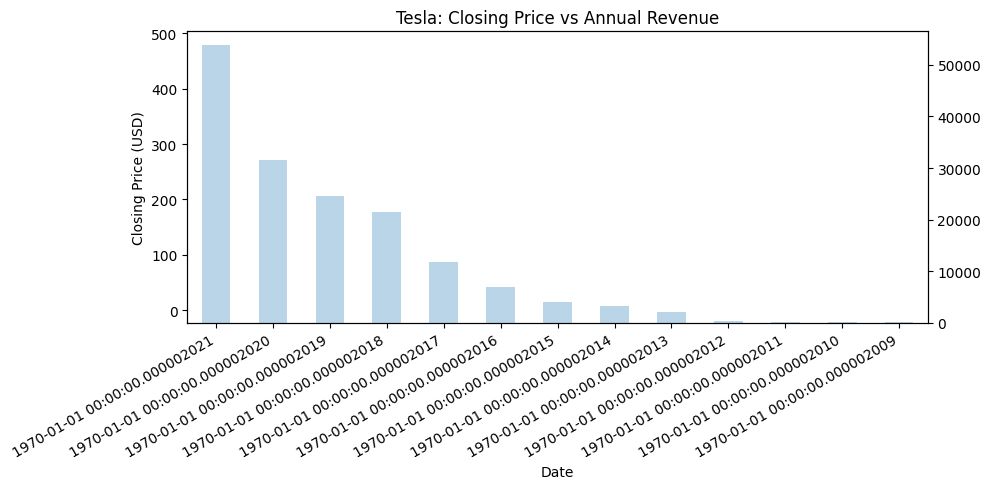
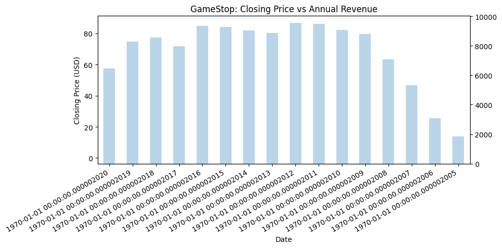

```python
# ----------------------------------------------------------
# 0. Import required libraries
# ---------------------------------------------------------
import pandas as pd
import yfinance as yf

from bs4 import BeautifulSoup
import requests

import matplotlib.pyplot as plt


# ----------------------------------------------------------
# 1. Extract Tesla (TSLA) stock data using yfinance
# ----------------------------------------------------------
tesla = yf.Ticker("TSLA")

tesla_data = tesla.history(period="max")

tesla_data.reset_index(inplace=True)

# Display first 5 rows of the data
tesla_data.head()
```


<div>
<style scoped>
    .dataframe tbody tr th:only-of-type {
        vertical-align: middle;
    }

    .dataframe tbody tr th {
        vertical-align: top;
    }

    .dataframe thead th {
        text-align: right;
    }
</style>
<table border="1" class="dataframe">
  <thead>
    <tr style="text-align: right;">
      <th></th>
      <th>Date</th>
      <th>Open</th>
      <th>High</th>
      <th>Low</th>
      <th>Close</th>
      <th>Volume</th>
      <th>Dividends</th>
      <th>Stock Splits</th>
    </tr>
  </thead>
  <tbody>
    <tr>
      <th>0</th>
      <td>2010-06-29 00:00:00-04:00</td>
      <td>1.266667</td>
      <td>1.666667</td>
      <td>1.169333</td>
      <td>1.592667</td>
      <td>281494500</td>
      <td>0.0</td>
      <td>0.0</td>
    </tr>
    <tr>
      <th>1</th>
      <td>2010-06-30 00:00:00-04:00</td>
      <td>1.719333</td>
      <td>2.028000</td>
      <td>1.553333</td>
      <td>1.588667</td>
      <td>257806500</td>
      <td>0.0</td>
      <td>0.0</td>
    </tr>
    <tr>
      <th>2</th>
      <td>2010-07-01 00:00:00-04:00</td>
      <td>1.666667</td>
      <td>1.728000</td>
      <td>1.351333</td>
      <td>1.464000</td>
      <td>123282000</td>
      <td>0.0</td>
      <td>0.0</td>
    </tr>
    <tr>
      <th>3</th>
      <td>2010-07-02 00:00:00-04:00</td>
      <td>1.533333</td>
      <td>1.540000</td>
      <td>1.247333</td>
      <td>1.280000</td>
      <td>77097000</td>
      <td>0.0</td>
      <td>0.0</td>
    </tr>
    <tr>
      <th>4</th>
      <td>2010-07-06 00:00:00-04:00</td>
      <td>1.333333</td>
      <td>1.333333</td>
      <td>1.055333</td>
      <td>1.074000</td>
      <td>103003500</td>
      <td>0.0</td>
      <td>0.0</td>
    </tr>
  </tbody>
</table>
</div>


```python
# ----------------------------------------------------------
# 2. Extract Tesla revenue data via Web Scraping
# ------------------------------------------------------
url = "https://cf-courses-data.s3.us.cloud-object-storage.appdomain.cloud/IBMDeveloperSkillsNetwork-PY0220EN-SkillsNetwork/labs/project/revenue.htm"
tesla_revenue_data = requests.get(url).text

tesla_revenue_soup = BeautifulSoup(tesla_revenue_data, 'html.parser')
tesla_revenue = pd.DataFrame(columns=['Date','Revenue'])
for row in tesla_revenue_soup.find_all("tbody")[1].find_all('tr'):
    col = row.find_all("td")
    revenue = col[1].text
    date = col[0].text
    

    tesla_revenue = pd.concat([tesla_revenue, pd.DataFrame({"Date":[date], "Revenue" : [revenue]})], ignore_index = True)
    tesla_revenue["Revenue"] = tesla_revenue["Revenue"].str.replace(',|\$',"", regex=True)
    tesla_revenue.dropna()

tesla_revenue = tesla_revenue[tesla_revenue["Revenue"] != ""]
tesla_revenue.tail()
```


<div>
<style scoped>
    .dataframe tbody tr th:only-of-type {
        vertical-align: middle;
    }

    .dataframe tbody tr th {
        vertical-align: top;
    }

    .dataframe thead th {
        text-align: right;
    }
</style>
<table border="1" class="dataframe">
  <thead>
    <tr style="text-align: right;">
      <th></th>
      <th>Date</th>
      <th>Revenue</th>
    </tr>
  </thead>
  <tbody>
    <tr>
      <th>48</th>
      <td>2010-09-30</td>
      <td>31</td>
    </tr>
    <tr>
      <th>49</th>
      <td>2010-06-30</td>
      <td>28</td>
    </tr>
    <tr>
      <th>50</th>
      <td>2010-03-31</td>
      <td>21</td>
    </tr>
    <tr>
      <th>52</th>
      <td>2009-09-30</td>
      <td>46</td>
    </tr>
    <tr>
      <th>53</th>
      <td>2009-06-30</td>
      <td>27</td>
    </tr>
  </tbody>
</table>
</div>


```python
# ----------------------------------------------------------
# 3. Extract GameStop (GME) stock data using yfinance
# ---------------------------------------------
gme = yf.Ticker("GME")

#
gme_data = gme.history(period="max")
# Reset index so 'Date' becomes a column
gme_data.reset_index(inplace=True)
# Display the first 5 rows of the dataset 
gme_data.head()
```


<div>
<style scoped>
    .dataframe tbody tr th:only-of-type {
        vertical-align: middle;
    }

    .dataframe tbody tr th {
        vertical-align: top;
    }

    .dataframe thead th {
        text-align: right;
    }
</style>
<table border="1" class="dataframe">
  <thead>
    <tr style="text-align: right;">
      <th></th>
      <th>Date</th>
      <th>Open</th>
      <th>High</th>
      <th>Low</th>
      <th>Close</th>
      <th>Volume</th>
      <th>Dividends</th>
      <th>Stock Splits</th>
    </tr>
  </thead>
  <tbody>
    <tr>
      <th>0</th>
      <td>2002-02-13 00:00:00-05:00</td>
      <td>1.620128</td>
      <td>1.693350</td>
      <td>1.603296</td>
      <td>1.691666</td>
      <td>76216000</td>
      <td>0.0</td>
      <td>0.0</td>
    </tr>
    <tr>
      <th>1</th>
      <td>2002-02-14 00:00:00-05:00</td>
      <td>1.712707</td>
      <td>1.716074</td>
      <td>1.670626</td>
      <td>1.683251</td>
      <td>11021600</td>
      <td>0.0</td>
      <td>0.0</td>
    </tr>
    <tr>
      <th>2</th>
      <td>2002-02-15 00:00:00-05:00</td>
      <td>1.683250</td>
      <td>1.687458</td>
      <td>1.658001</td>
      <td>1.674834</td>
      <td>8389600</td>
      <td>0.0</td>
      <td>0.0</td>
    </tr>
    <tr>
      <th>3</th>
      <td>2002-02-19 00:00:00-05:00</td>
      <td>1.666418</td>
      <td>1.666418</td>
      <td>1.578047</td>
      <td>1.607504</td>
      <td>7410400</td>
      <td>0.0</td>
      <td>0.0</td>
    </tr>
    <tr>
      <th>4</th>
      <td>2002-02-20 00:00:00-05:00</td>
      <td>1.615920</td>
      <td>1.662210</td>
      <td>1.603296</td>
      <td>1.662210</td>
      <td>6892800</td>
      <td>0.0</td>
      <td>0.0</td>
    </tr>
  </tbody>
</table>
</div>


```python
# ------------------------------------------
# 4. Extract GameStop revenue data via Web Scraping
# ----------------------------------------------------------
url = "https://cf-courses-data.s3.us.cloud-object-storage.appdomain.cloud/IBMDeveloperSkillsNetwork-PY0220EN-SkillsNetwork/labs/project/stock.html"
tesla_revenue_data = requests.get(url).text

tesla_revenue_soup = BeautifulSoup(tesla_revenue_data, 'html.parser')
tesla_revenue = pd.DataFrame(columns=['Date','Revenue'])
for row in tesla_revenue_soup.find_all("tbody")[1].find_all('tr'):
    col = row.find_all("td")
    revenue = col[1].text
    date = col[0].text
    

    tesla_revenue = pd.concat([tesla_revenue, pd.DataFrame({"Date":[date], "Revenue" : [revenue]})], ignore_index = True)
    tesla_revenue["Revenue"] = tesla_revenue["Revenue"].str.replace(',|\$',"", regex=True)
    tesla_revenue.dropna()

tesla_revenue = tesla_revenue[tesla_revenue["Revenue"] != ""]
tesla_revenue.tail()
```


<div>
<style scoped>
    .dataframe tbody tr th:only-of-type {
        vertical-align: middle;
    }

    .dataframe tbody tr th {
        vertical-align: top;
    }

    .dataframe thead th {
        text-align: right;
    }
</style>
<table border="1" class="dataframe">
  <thead>
    <tr style="text-align: right;">
      <th></th>
      <th>Date</th>
      <th>Revenue</th>
    </tr>
  </thead>
  <tbody>
    <tr>
      <th>57</th>
      <td>2006-01-31</td>
      <td>1667</td>
    </tr>
    <tr>
      <th>58</th>
      <td>2005-10-31</td>
      <td>534</td>
    </tr>
    <tr>
      <th>59</th>
      <td>2005-07-31</td>
      <td>416</td>
    </tr>
    <tr>
      <th>60</th>
      <td>2005-04-30</td>
      <td>475</td>
    </tr>
    <tr>
      <th>61</th>
      <td>2005-01-31</td>
      <td>709</td>
    </tr>
  </tbody>
</table>
</div>


```python
 #----------------------------------------------------------
# 5. Tesla Dashboard: Stock Price vs Revenue using pandas.plot()
# --------------------------------------------------

tesla_data.reset_index(inplace=True)

ax1 = tesla_data.plot(
    x="Date", 
    y="Close",
    title="Tesla: Closing Price vs Annual Revenue",
    figsize=(10, 5),
    legend=False
)


ax1.set_ylabel("Closing Price (USD)")
tesla_rev.plot(
    x="Date", 
    y="Revenue", 
    kind="bar",
    ax=ax1.twinx(), 
    alpha=0.3,
    legend=False
)

ax1.right_ax = ax1.get_shared_x_axes()
# Adjust layout to avoid clipping
ax1.figure.tight_layout()
```


    

    


```python
# ----------------------------------------------------------
# 6. GameStop Dashboard: Stock Price vs Revenue using pandas.plot()
# --------------------------------

ax2 = gme_data.plot(
    x="Date", 
    y="Close",
    title="GameStop: Closing Price vs Annual Revenue",
    figsize=(10, 5),
    legend=False
)
ax2.set_ylabel("Closing Price (USD)")
gme_rev.plot(
    x="Date", 
    y="Revenue", 
    kind="bar",
    ax=ax2.twinx(), 
    alpha=0.3,
    legend=False
)
# Ajust layout to avoid label clipping
ax2.figure.tight_layout()
```


    

    


```python

```
